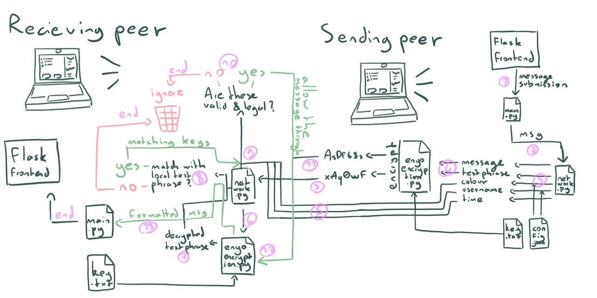

# LAN Chatroom

This is a LAN chatroom made by your beloved Ornithopter747. It is made to be used in a completely decentralised way on a single network, allowing peer-to-peer chatting without any (external) servers.



## Table of contents

- [LAN Chatroom](#lan-chatroom)
  - [Table of contents](#table-of-contents)
- [How to Use](#how-to-use)
  - [Download and Dependencies](#download-and-dependencies)
  - [Necessary Configuration](#necessary-configuration)
  - [Extra configuration](#extra-configuration)
    - [Browsers](#browsers)
    - [Ports](#ports)
  - [Encryption](#encryption)
  - [Run it](#run-it)
  - [Updating](#updating)
  - [Plans for the Future](#plans-for-the-future)
  - [Want to Contribute?](#want-to-contribute)
  - [Want to Fork or use this code?](#want-to-fork-or-use-this-code)
- [New Features](#new-features)
  - [Latest Features](#latest-features)
    - [Simple Stuff (for you buffoons)](#simple-stuff-for-you-buffoons)
    - [Technical Stuff](#technical-stuff)
  - [Features From Earlier](#features-from-earlier)

# How to Use

The setting up is a bit long. Sorry for the inconvenience, but I do recommend reading all of this document up until [Updating](#updating).

## Download and Dependencies

Download this repository by running the following command in your terminal.

```bash
git clone https://github.com/ornitongithub/lan-chatroom
```


Open the folder you just downloaded.

Install Flask by running:

```bash
pip3 install flask
```

If that doesn't work, try:

```bash
pip3 install --trusted-host pypi.org --trusted-host pypi.python.org --trusted-host files.pythonhosted.org flask --user
```

## Necessary Configuration

There is a configuration file called `settings.json` that looks like this:

```json
{
  "username": "YourUsernameHere",
  "port": 12345,
  "colour": "black",
  "open_browser": true,
  "browser": null
}
```

This is where you can change different settings. To edit them, simply edit the field after the `:` like this:

```json
    [...]
    "username" : "My new cool username",
    [...]             |
                      |
This was changed. <---'
```

If you messed up or for any other reason want to reset, run

```bash
git reset --hard
```

`username`: a legal username is between 3-20 characters, and contains no newline characters.

`port`: the port you're chatting on. Think of this as a room. You only send and recieve messages from a certain port. Either use the default port `12345` or agree on a new port with your friends.

`colour`: the colour your messages will appear. Possible colours are:

- <span style="color:red">red</span>
- <span style="color:orange">orange</span>
- <span style="color:gold">gold</span>
- <span style="color:green">green</span>
- <span style="color:blue">blue</span>
- <span style="color:purple">purple</span>
- <span style="color:black">black</span>

## Extra configuration

(and other info)

**Skip this part if you're not running into errors.**

### Browsers

`open_browser` dictates wether the program will automatically open the browser for you (this is a web app). If you set it to false, you'll have to start your browser and visit `localhost:5000` yourself.

`browser` is the browser that gets open by default. `null` will open your default browser. If it doesn't work, or if you want to set the browser manually, change it like in these examples:

```json
    "browser" : "firefox",
```

```json
    "browser" : "safari",
```

### Ports

By the way, the port number is always odd, as the following even port is used for other parts of the script (pinging users. If you set the port to an even number, it will be rounded up to the next odd number). <br>
If you were to use an even port, the program would just round it up to the next odd port. <br>
Also, some ports are reserved for other activity by your computer. The free ports generally are `49152 - 65535`. <br>
Keep in mind ports are not a security measure. Encyption is.

## Encryption

This program supports **symmetric** encryption. When sending a message, it gets encrypted with the encryption key. The default one is "default". It can be found in `key.txt`.

Any messages that cannot be decrypted (with your encryption key) will simply not be displayed. Make sure you and all your chatmates use the same key.

By the way, the key can be pretty much anything you can fit into that text file.

## Run it

Run `main.py`. Either by running it in VSCode or by running

```bash
python3 main.py
```

in your terminal. Make sure you're using python interpret 3.10+

Normally a browser window should open automatically. If it does not, ckeck [Extra config](#extra-config).

Now that your browser opened the app, you can start chatting.

If your browser says "page not found" or anything along those lines, just try reloading the page.

To close the app, press `ctrl+c` in your terminal.

## Updating

You can run the update script:

```bash
python3 update.py
```

This script updates and saves your config file.

## Plans for the Future

We are now in the final release. My only plan for the future is asymmetric encryption.

(NOTE: Everything is in `docs/todo.md`)

## Want to Contribute?

You can make a pull request. I will only accept *clean* bug fixes and small patches of the sort. No big features, sorry.

## Want to Fork or use this code?

Make sure you respect the `LICENSE` please. Thank you.

# New Features

## Latest Features

### Simple Stuff (for you buffoons)

- Added encryption and other security measures.
- Chat messages are way more consistent now. There are almost no more issues.
- The app is generally more usable
- This new version is ***not*** compatible with earlier versions. Beware.
- Read [Encryption](#encryption) for info about how encryption works.

### Technical Stuff

- Re-wrote `network.py`
  - The user pinging function also grabs their IP, which is then used for TCP communication to ensure message arrival.
  - The listen function, the one that handles the message recieving now also checks for the validity of the message.
    - Is the username legal?
    - Are we using the same encryption key? (this is determined by decrypting a "test phrase" that was encrypted by the sender)
    - Is the colour prefix legal?
    - Also, messages are now json objects, and are formatted by the reciever instead of by the sender.
  - Messages are now stored in memory and not messages.txt. Also, users now only send a single message, and the recievers simply append it to their own history of messages. This is safer and less chaotic than before. Fun fact: you recieve your own message just like everybody else, your computer binds to itself lol. This is not an issue that needs to be fixed btw.
- Encrypting
  - I am using the enyo library, from which i just copy-pasted the code instead of manageing it through pip, to reduce the amount of dependencies. I also slightly edited it to my liking.
  - The encryption key is located in key.txt
- Extra
  - There are minor and negligible changes to the frontend
    - Slightly changed the handling of colour prefixes.
    - Changed some refresh intervals.

## Features From Earlier

Here previous update notes will be kept.